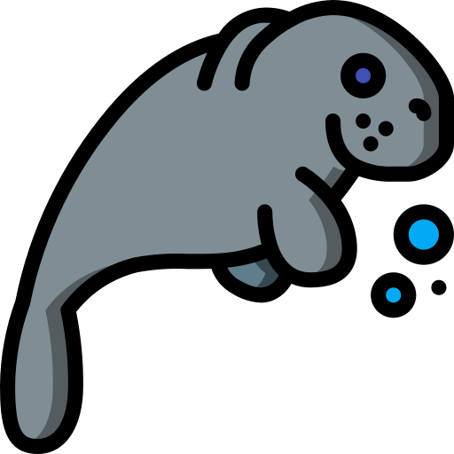

<!-- README.md is generated from README.Rmd. Please edit that file -->

# mammals 

<!-- badges: start -->

[](https://lifecycle.r-lib.org/articles/stages.html#experimental)
[](https://CRAN.R-project.org/package=mammals)
[](https://app.codecov.io/gh/matcasti/mammals?branch=master)
[](https://github.com/matcasti/mammals/actions)
<!-- badges: end -->

The goal of `mammals` is to provide tools for the implementation of
population dynamics analysis.

## Installation

You can install the development version of mammals like so:

``` r
# install.packages("remotes")
remotes::install_github("matcasti/mammals")
```

## Example

This is a basic example which shows you how to solve a common problem:

``` r
library(mammals)
## basic example code
```

## Code of Conduct

Please note that the mammals project is released with a [Contributor
Code of
Conduct](https://contributor-covenant.org/version/2/0/CODE_OF_CONDUCT.html).
By contributing to this project, you agree to abide by its terms.
